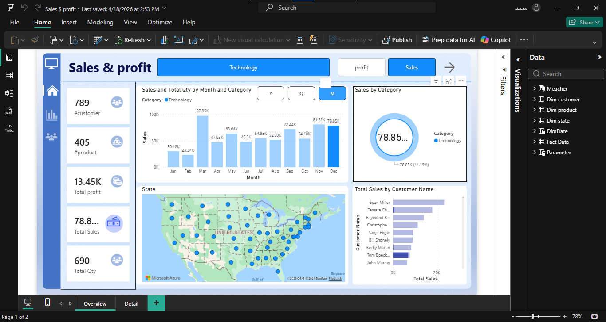

# PowerBI-Sales-Profit-Dashboard
An interactive Power BI dashboard designed to analyze sales performance, profitability, customers, products, and geographic distribution.

## Project Overview

This project provides an interactive view of sales and profit performance across different product categories and locations.
The dashboard allows users to explore the data through interactive filters and visualizations.

## Key KPIs

- 👥 Total Customers: 789
- 📦 Total Products: 405
- 💰 Total Profit: 121.86K
- 🛒 Total Quantity: 6K
- 💵 Total Sales: 704.45K

## Dashboard Analysis

The dashboard includes:
- Monthly Sales Analysis
- Sales by Product Category
- Sales by State
- Top Customers by Sales
- Total Sales and Profit Analysis
- Quantity Analysis
- Interactive Category Filters
- Sales & Profit Views

## Tools & Technologies

- Power BI
- DAX
- Microsoft Excel
- Data Cleaning & Transformation
- Data Visualization

##  Dashboard Preview

## Project Files

- `Sales $ profit.pbix` — Power BI project file
- `Screenshot 2026-09-24 131328.png` — Dashboard preview

## Objective

The main objective of this project is to transform raw sales data into an interactive dashboard that provides clear insights into sales performance, profitability, customers, products, and geographic trends.

## Author

**Mohamed Labeeb**

Data Analyst | AI & Machine Learning Enthusiast
